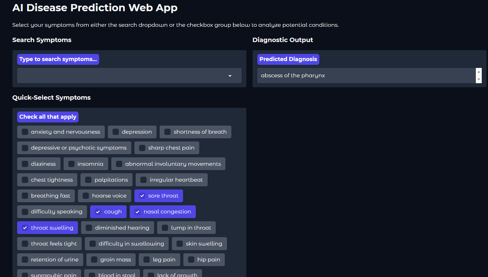

# AI-Powered Disease Prediction Web App

A supervised machine learning application that predicts potential health conditions based on a combination of user-submitted symptoms. Built using Python, Scikit-learn, and an interactive Gradio web interface.

## Project Overview
This project maps multi-feature user symptom inputs into diagnostic predictions. By utilizing binary vector mapping, the interface aggregates symptoms selected from both a search-enabled dropdown and a quick-select checkbox list to deliver real-time model inference.

## Technical Stack
* **Machine Learning:** Scikit-learn (Decision Tree Classifier)
* **Data Manipulation:** Pandas
* **Pipeline Serialization:** Joblib
* **User Interface:** Gradio (Soft Theme Implementation)

## How to Run Locally

1. Clone the repository:
   git clone [https://github.com/AbduulahAhmed04/disease-prediction-ml.git](https://github.com/AbdullahAhmed04/disease-prediction-ml.git)
cd disease-prediction-ml

2. Install Dependencies:
   pip install -r requirements.txt.txt
   
3. Verify Model Access:
   Ensure disease_model.pkl, label_encoder.pkl, and symptoms.pkl are sitting in the root directory. If missing, run the training notebook inside the notebooks/ directory to generate them

4. Launch the App:
   python app.py

# License
Distributed under the MIT License
